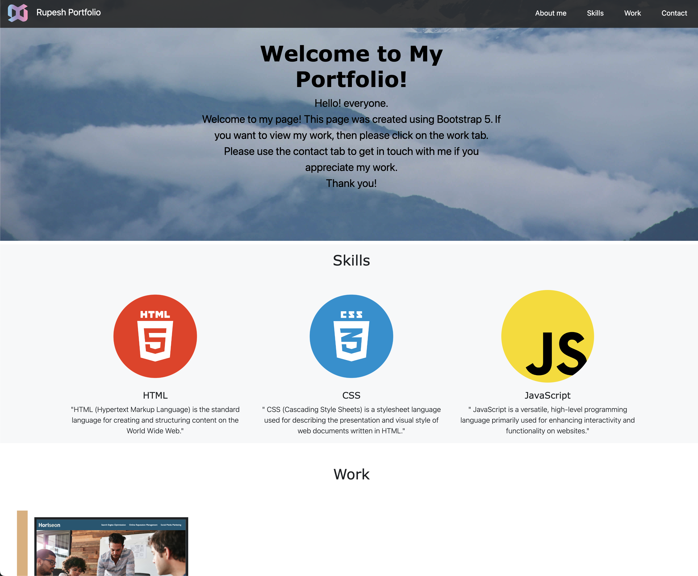

# Rupesh-Bootstrap-Portfolio
This is my bootstrap portfolio, which was created using Bootstrap 5, and it shows all the webwork that I have learned in the third week of frontend developer bootcamp.

## Description

This portfolio was created to showcase my project using bootstrap 5, in my frontend developer bootcamp.

- The motivation behind this project to showcase all the project what I have learned and created  using bootstrap 5 in my frontend bootcamp.
- This project was build because to show that what I have learned so far in my bootcamp and to build the confidence as frontend developer.
- This project help to enhance the knowledge and show the progression of my project.
- My knowledge of an HTML and CSS website with a clear structure has increased as a result of this assignment. The significance of CSS grid layout, flexbox, and wire framing has also been explained to me. Also, I now know how to use Bootstrap 5.

## Installation

N/A

## Usage

To view and interact with the website:
- Open the index.html file in web browser.
- Click the about me, work or contact me to jump in the page.
- Click the link in the work tab to navigate in the project.

Provide instructions and examples for use. Include screenshots as needed.

## Credits

N/A

## License

N/A

